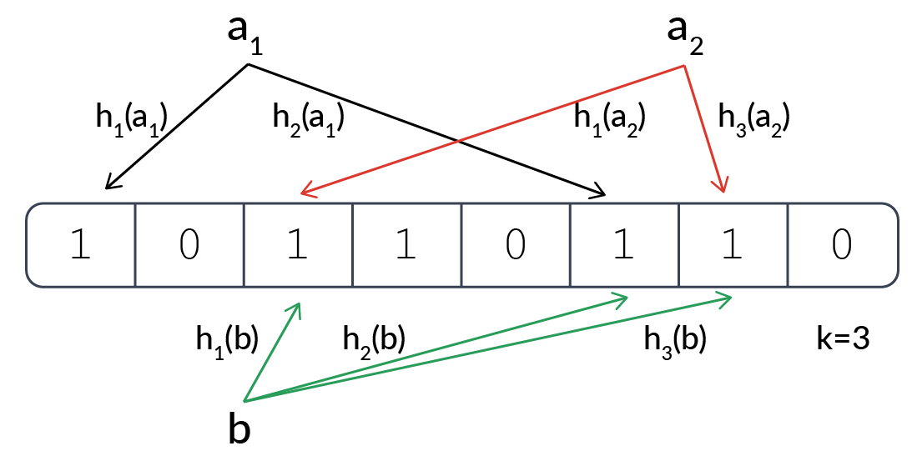

# 布隆过滤器（Bloom Filter）

> False is always false. True is maybe true.

布隆过滤器是一种比较巧妙的概率型数据结构，由二进制向量（bit 数组）和一系列随机映射函数（哈希函数）两部分组成。特点就是高效地插入和查询，时间效率和空间利用率都很高，可以用来告诉你 **“某样东西一定不存在或者可能存在”**。

### 为什么不用哈希表，要用布隆过滤器？

通常要判断某个元素是否存在，我们都会用哈希表。虽然哈希表的查询效率很高，但是也有缺点，比如负载因子的存在决定了哈希表的空间不能被用满，而且一旦数据量大，存储容量占用也高。

### 核心

#### 1. 存储结构：bit 数组

#### 2. 一系列哈希函数

### 原理

#### 添加元素

1. 使用布隆过滤器中的哈希函数对元素值进行计算，得到哈希值（有几个哈希函数得到几个哈希值）。

2. 根据得到的哈希值，将 bit 数组中把对应下标的值置为 1。

#### 判断元素是否存在

1. 使用布隆过滤器中的哈希函数对元素值进行计算，得到哈希值（有几个哈希函数得到几个哈希值）。

2. 根据得到的哈希值，判断 bit 数组中对应下标的值是否都为 1。如果值都为 1，那么说明这个元素在布隆过滤器中（可能）存在；如果存在一个值不为 1，说明该元素一定不在布隆过滤器中。

### 缺点

- 误判。判断结果是不存在，那就一定不存在；但是**判断结果是存在，实际上不一定存在**。

- 删除麻烦。删除的时候不能简单的直接置为 0，可能会影响其他元素的判断。

### 使用场景

#### 1. 判断数据是否存在

- 解决 Redis 缓存穿透问题
- 黑/白名单

#### 2. 去重

- 爬虫对已经爬取过的 URL 去重
- 根据历史浏览记录，对推荐推送去重

### 开源实现

#### 1. Guava 中的布隆过滤器

但是仅单机使用

#### 2. Redis 中的布隆过滤器

Redis 4.0 之后提供了 Module（模块/插件） 功能，Redis Modules 让 Redis 可以使用外部模块扩展其功能。

官方推荐 [RedisBloom](https://github.com/RedisBloom/RedisBloom) 作为 Redis 布隆过滤器的 Module。

### 误判率的影响因素

#### 1. bit 数组长度

数组长度太小，很快所有的 bit 都会被置为 1，那么判断任何元素都返回可能存在。所以 bit 数组长度会直接影响误报率，长度越长其误报率越小。

#### 2. 哈希函数个数

- 哈希函数的个数越多，bit 置为 1 的速度越快；而且计算哈希值的时间也越长，布隆过滤器的效率也会降低；
- 但是如果太少的话，判断的 bit 位数也少，误报率会变高。

### 如何删除

### 参考

- [详解布隆过滤器的原理，使用场景和注意事项 - YoungChen的文章 - 知乎](https://zhuanlan.zhihu.com/p/43263751)

- [不了解布隆过滤器？一文给你整的明明白白！ - Snailclimb - GitHub](https://github.com/Snailclimb/JavaGuide/blob/master/docs/dataStructures-algorithms/data-structure/bloom-filter.md)

- [Redis(5)——亿级数据过滤和布隆过滤器](https://www.wmyskxz.com/2020/03/11/redis-5-yi-ji-shu-ju-guo-lu-he-bu-long-guo-lu-qi/)